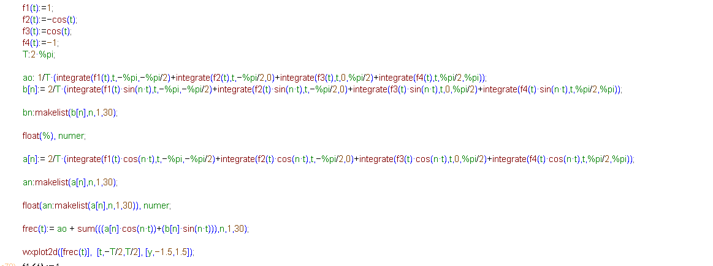
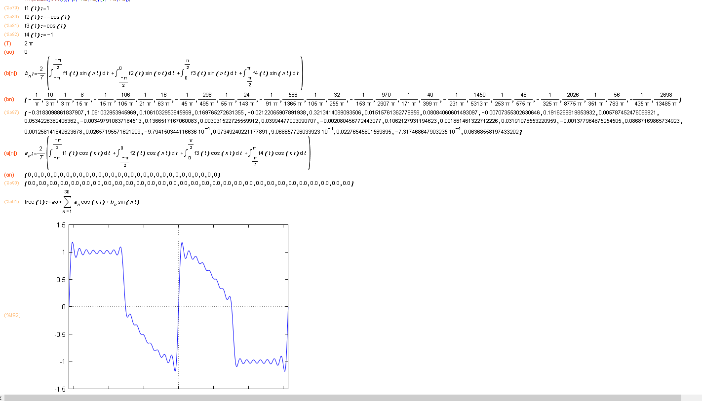

### Síntesis de Fourier para función periódica por tramos

```maxima
/* Función temporal */
T: 2*%pi;
f1(t):=1; /* Defino f1 como tramo 1 */
f2(t):=-cos(t); /* Defino f2 como tramo 2 */
f3(t):=cos(t); /* Defino f3 como tramo 3 */
f4(t):=-1; /* Defino f4 como tramo 4 */

tics:[-T/4,-T/500, T/4, T/2]; /* Puntos de inflexión, dónde cambia la función */
V(t):=[f1(t),f2(t),f3(t), f4(t)]; /* Espacio del período destinado a cada tramo */
g(t):=(if t<= tics[1] then V(t)[1]
     else if t<= tics[2] then V(t)[2]
     else if t<= tics[3] then V(t)[3]
     else if t<= tics[4] then V(t)[4]); /* Definición de la función total */ 

wxplot2d([g(t)],[t,-T/2,T/2], [y,-1.1,1.1])$ /* Invocación del gráfico de la función de 1 período */;

/* Cálculo coeficientes de la serie */
ao: 1/T*(integrate(f1(t),t,-%pi,-%pi/2)+integrate(f2(t),t,-%pi/2,0)+integrate(f3(t),t,0,%pi/2)+integrate(f4(t),t,%pi/2,%pi));
b[n]:= 2/T*(integrate(f1(t)*sin(n*t),t,-%pi,-%pi/2)+integrate(f2(t)*sin(n*t),t,-%pi/2,0)+integrate(f3(t)*sin(n*t),t,0,%pi/2)+integrate(f4(t)*sin(n*t),t,%pi/2,%pi));
bn:makelist(b[n],n,1,30);
float(%), numer;
a[n]:= 2/T*(integrate(f1(t)*cos(n*t),t,-%pi,-%pi/2)+integrate(f2(t)*cos(n*t),t,-%pi/2,0)+integrate(f3(t)*cos(n*t),t,0,%pi/2)+integrate(f4(t)*cos(n*t),t,%pi/2,%pi));

/* Cálculo y gráfico de la síntesis de la función usando solo 30 armónicos */
an:makelist(a[n],n,1,30);
float(an:makelist(a[n],n,1,30)), numer;
frec(t):= ao + sum(((a[n]*cos(n*t))+(b[n]*sin(n*t))),n,1,30);
wxplot2d([frec(t)],  [t,-T/2,T/2], [y,-1.5,1.5]); /* Reconstrucción */






